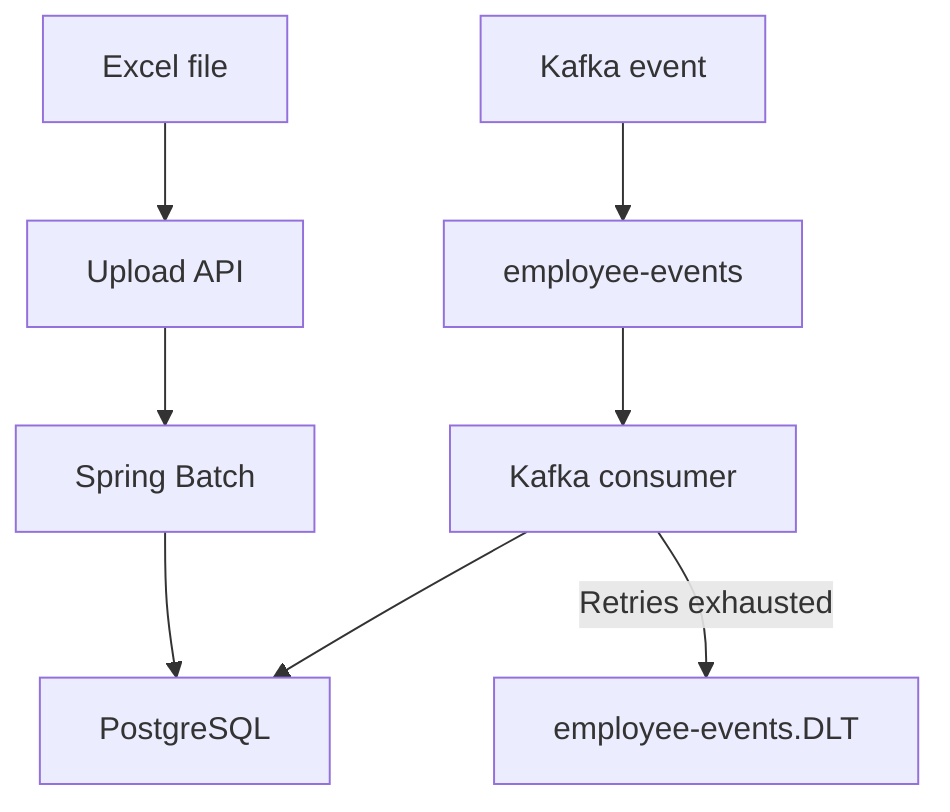

# Employee Ingestion Platform

A production-style Spring Boot platform for ingesting employee records through Excel files and Kafka events.

The application supports secure REST APIs, asynchronous batch processing, Kafka retry and dead-letter handling, PostgreSQL persistence, filtering, pagination, correlation IDs, Docker-based local deployment, Swagger documentation, and automated test coverage enforcement.

## Technology Stack

* Java 25
* Spring Boot 4.1.1
* Spring Batch
* Spring Data JPA
* Spring Security and JWT
* Apache Kafka
* PostgreSQL
* Flyway
* Apache POI
* Maven
* Docker and Docker Compose
* Springdoc OpenAPI and Swagger UI
* JUnit 5 and Mockito
* JaCoCo

## Features

* JWT-based authentication
* Role-based authorization with `ADMIN` and `USER`
* Excel file upload and tracking
* Manual and scheduled batch processing
* Chunk-oriented processing with a chunk size of 500
* Row-level validation and rejected-record tracking
* Paginated employee retrieval
* Employee filtering by ID, email, department, source, and salary
* Configurable employee sorting
* Kafka-based employee ingestion
* Kafka retry and dead-letter topic handling
* Duplicate employee validation
* Correlation IDs for request tracing
* Consistent API error responses
* Flyway-managed database migrations
* Dockerized application, PostgreSQL, and Kafka
* Interactive Swagger API documentation
* Ready-to-import Postman collection
* Automated JaCoCo coverage verification

## Architecture

The application supports two employee-ingestion paths.



### Excel ingestion

1. A client uploads an `.xlsx` file.
2. The application stores the file under `data/uploads`.
3. An `upload_tracking` record is created with `PENDING` status.
4. Processing is launched manually or by the scheduler.
5. Spring Batch reads, validates, and writes records in chunks of 500.
6. Invalid rows are stored in `rejected_records`.
7. The final status becomes `COMPLETED`, `PARTIALLY_COMPLETED`, or `FAILED`.

### Kafka ingestion

1. A producer publishes an employee event to `employee-events`.
2. The Kafka consumer deserializes and validates the event.
3. Valid employees are saved with source `KAFKA`.
4. Invalid or duplicate events are retried.
5. Events that exhaust their retries are published to `employee-events.DLT`.

## Prerequisites

Install:

* Docker Desktop
* Java 25
* Git

The Maven Wrapper is included, so a separate Maven installation is optional.

Verify the required tools:

```bash
java -version
docker --version
docker compose version
git --version
```

## Project Structure

```text
employee-ingestion-platform/
├── postman/
│   └── Employee-Ingestion-Platform.postman_collection.json
├── samples/
│   ├── DEMO.md
│   ├── excel/
│   │   ├── employees-partial-failure.xlsx
│   │   └── employees-valid-10000.xlsx
│   └── kafka/
│       ├── duplicate-employee.json
│       ├── invalid-employee.json
│       └── valid-employee.json
├── src/
│   ├── main/
│   │   ├── java/
│   │   └── resources/
│   │       └── db/migration/
│   └── test/
├── .env.example
├── Dockerfile
├── docker-compose.yml
├── pom.xml
└── README.md
```

## Configuration

The application supports the following environment variables:

| Variable                  | Purpose                 | Local value                                   |
| ------------------------- | ----------------------- | --------------------------------------------- |
| `DB_URL`                  | PostgreSQL JDBC URL     | `jdbc:postgresql://postgres:5432/employee_db` |
| `DB_USERNAME`             | PostgreSQL username     | `employee_user`                               |
| `DB_PASSWORD`             | PostgreSQL password     | `employee_password`                           |
| `KAFKA_BOOTSTRAP_SERVERS` | Kafka broker address    | `kafka:19092`                                 |
| `KAFKA_GROUP_ID`          | Kafka consumer group    | `employee-ingestion-group`                    |
| `UPLOAD_DIRECTORY`        | Uploaded-file directory | `/app/data/uploads`                           |
| `JWT_SECRET`              | JWT signing secret      | Local development value                       |
| `JWT_EXPIRY_MINUTES`      | JWT lifetime            | `60`                                          |
| `SERVER_PORT`             | Application port        | `8080`                                        |

The credentials and JWT secret in Docker Compose are for local demonstration only. They must be replaced with securely managed secrets in production.

## Start the Platform

From the project root, run:

```bash
docker compose up -d --build
```

Check container status:

```bash
docker compose ps
```

Expected containers:

* `employee-application`
* `employee-postgres`
* `employee-kafka`

Follow application logs:

```bash
docker logs -f employee-application
```

Wait until the logs contain:

```text
Started EmployeeIngestionPlatformApplication
```

Stop following logs with `Control + C`.

## Health Check

```bash
curl -i http://localhost:8080/actuator/health
```

Expected response:

```json
{
  "status": "UP"
}
```

## Default Users

The application creates two local demonstration users:

| Username | Password    | Role    |
| -------- | ----------- | ------- |
| `admin`  | `Admin@123` | `ADMIN` |
| `user`   | `User@123`  | `USER`  |

These credentials are intended only for local assignment demonstration.

## Authentication

Log in as administrator:

```bash
curl -s -X POST \
  http://localhost:8080/api/auth/login \
  -H "Content-Type: application/json" \
  -d '{"username":"admin","password":"Admin@123"}'
```

Example response:

```json
{
  "accessToken": "eyJ...",
  "tokenType": "Bearer",
  "expiresInSeconds": 3600
}
```

Store the returned token:

```bash
export EMPLOYEE_TOKEN='paste-access-token-here'
```

Protected requests require:

```text
Authorization: Bearer <access-token>
```

## Role Authorization

| Operation                 | ADMIN | USER |
| ------------------------- | ----: | ---: |
| Login                     |   Yes |  Yes |
| Retrieve employees        |   Yes |  Yes |
| Upload Excel files        |   Yes |   No |
| Retrieve upload status    |   Yes |   No |
| Process uploads manually  |   Yes |   No |
| Retrieve rejected records |   Yes |   No |

A missing or invalid token returns `401 Unauthorized`.

A valid token without the required role returns `403 Forbidden`.

## REST APIs

| Method | Endpoint                                            | Description                                    | Required role |
| ------ | --------------------------------------------------- | ---------------------------------------------- | ------------- |
| `POST` | `/api/auth/login`                                   | Authenticate and generate a JWT                | Public        |
| `GET`  | `/api/v1/employees`                                 | Retrieve, filter, sort, and paginate employees | ADMIN or USER |
| `POST` | `/api/v1/employees/upload`                          | Upload an Excel file                           | ADMIN         |
| `GET`  | `/api/v1/employees/uploads/{trackingId}`            | Retrieve upload status                         | ADMIN         |
| `POST` | `/api/v1/employees/uploads/{trackingId}/process`    | Process a pending upload                       | ADMIN         |
| `GET`  | `/api/v1/employees/uploads/{trackingId}/rejections` | Retrieve rejected rows                         | ADMIN         |
| `GET`  | `/actuator/health`                                  | Check application health                       | Public        |
| `GET`  | `/actuator/info`                                    | Retrieve application information               | Public        |

## API Documentation

Interactive API documentation is available while the application is running.

* Swagger UI: http://localhost:8080/swagger-ui.html
* OpenAPI JSON: http://localhost:8080/v3/api-docs
* OpenAPI YAML: http://localhost:8080/v3/api-docs.yaml

### Using JWT authentication in Swagger

1. Open Swagger UI.
2. Execute `POST /api/auth/login`.
3. Copy the `accessToken` from the response.
4. Click **Authorize**.
5. Paste only the token value, without adding `Bearer`.
6. Click **Authorize** and close the dialog.
7. Execute the protected APIs.

Swagger automatically sends:

```text
Authorization: Bearer <access-token>
```

These are local development links and require the application to be running.

## Postman Collection

Import:

```text
postman/Employee-Ingestion-Platform.postman_collection.json
```

The collection contains:

* Administrator login
* Regular-user login
* Paginated employee retrieval
* Filtered and sorted employee retrieval
* Excel upload
* Upload-status retrieval
* Manual processing
* Rejected-record retrieval
* Kafka-ingestion verification
* `401 Unauthorized` verification
* `403 Forbidden` verification
* Health check

Run `Login - Admin` first. Its post-response script automatically saves the JWT into the collection’s `token` variable.

Before publishing or sharing the collection, ensure that the exported `token` and `userToken` values are empty.

## Employee Search

Retrieve the first page:

```bash
curl -s \
  "http://localhost:8080/api/v1/employees?page=0&size=20&sort=empId,asc" \
  -H "Authorization: Bearer $EMPLOYEE_TOKEN"
```

Available filters:

| Parameter    | Description                                           |
| ------------ | ----------------------------------------------------- |
| `empId`      | Case-insensitive exact employee ID                    |
| `email`      | Case-insensitive exact email                          |
| `department` | Case-insensitive exact department                     |
| `source`     | `EXCEL` or `KAFKA`                                    |
| `minSalary`  | Minimum salary, inclusive                             |
| `maxSalary`  | Maximum salary, inclusive                             |
| `page`       | Zero-based page number                                |
| `size`       | Page size from 1 to 100                               |
| `sort`       | Allowed property and direction, such as `salary,desc` |

Example:

```bash
curl -s \
  "http://localhost:8080/api/v1/employees?page=0&size=20&department=Engineering&source=EXCEL&minSalary=50000&maxSalary=150000&sort=salary,desc" \
  -H "Authorization: Bearer $EMPLOYEE_TOKEN"
```

## Excel Upload and Processing

Upload the partial-failure sample:

```bash
curl -s -X POST \
  http://localhost:8080/api/v1/employees/upload \
  -H "Authorization: Bearer $EMPLOYEE_TOKEN" \
  -F "file=@samples/excel/employees-partial-failure.xlsx"
```

Example response:

```json
{
  "trackingId": "generated2bf-...-generated2bf",
  "fileName": "employees-partial-failure.xlsx",
  "status": "PENDING",
  "message": "File uploaded successfully and is awaiting processing"
}
```

Store the returned tracking ID:

```bash
export TRACKING_ID='paste-tracking-id-here'
```

Process the upload:

```bash
curl -s -X POST \
  "http://localhost:8080/api/v1/employees/uploads/$TRACKING_ID/process" \
  -H "Authorization: Bearer $EMPLOYEE_TOKEN"
```

Check its status:

```bash
curl -s \
  "http://localhost:8080/api5bf/api/v1/employees/uploads/$TRACKING_ID" \
  -H "Authorization: Bearer $EMPLOYEE_TOKEN"
```

Retrieve rejected rows:

```bash
curl -s \
  "http://localhost:8080/api/v1/employees/uploads/$TRACKING_ID/rejections?page=0&size=20" \
  -H "Authorization: Bearer $EMPLOYEE_TOKEN"
```

Possible upload statuses:

| Status                | Meaning                                    |
| --------------------- | ------------------------------------------ |
| `PENDING`             | Waiting for processing                     |
| `PROCESSING`          | Batch processing is running                |
| `COMPLETED`           | All rows were successfully processed       |
| `PARTIALLY_COMPLETED` | Some rows succeeded and some were rejected |
| `FAILED`              | The batch job failed                       |

## Excel Samples

### Valid 10,000-row workbook

```text
samples/excel/employees-valid-10000.xlsx
```

This workbook demonstrates:

* Large-file ingestion
* Chunk processing
* Successful completion
* Pagination over imported employees

Expected result on a fresh database:

```text
status: COMPLETED
totalRows: 10000
successRows: 10000
rejectedRows: 0
```

### Partial-failure workbook

```text
samples/excel/employees-partial-failure.xlsx
```

This workbook contains both valid and intentionally invalid rows.

It demonstrates:

* Validation failure handling
* Rejected-record persistence
* Partial completion
* Rejection-reason retrieval

## Kafka Samples

Kafka sample events are located under:

```text
samples/kafka/
```

### Send a valid event

```bash
{ tr -d '\n' < samples/kafka/valid-employee.json; echo; } | \
docker exec -i employee-kafka \
  /opt/kafka/bin/kafka-console-producer.sh \
  --bootstrap-server localhost:9092 \
  --topic employee-events
```

Verify the inserted employee:

```bash
docker exec employee-postgres \
  psql -U employee_user -d employee_db \
  -c "SELECT emp_id, email, source FROM employees WHERE emp_id = 'KAFKA90001';"
```

Expected source:

```text
KAFKA
```

### Send an invalid event

```bash
{ tr -d '\n' < samples/kafka/invalid-employee.json; echo; } | \
docker exec -i employee-kafka \
  /opt/kafka/bin/kafka-console-producer.sh \
  --bootstrap-server localhost:9092 \
  --topic employee-events
```

The event fails validation, is retried, and is eventually published to the dead-letter topic.

### Send a duplicate event

```bash
{ tr -d '\n' < samples/kafka/duplicate-employee.json; echo; } | \
docker exec -i employee-kafka \
  /opt/kafka/bin/kafka-console-producer.sh \
  --bootstrap-server localhost:9092 \
  --topic employee-events
```

This event reuses an existing employee ID and demonstrates duplicate protection.

### Read the dead-letter topic

```bash
docker exec employee-kafka \
  /opt/kafka/bin/kafka-console-consumer.sh \
  --bootstrap-server localhost:9092 \
  --topic employee-events.DLT \
  --from-beginning \
  --timeout-ms 5000
```

## Correlation IDs

Every HTTP response contains:

```text
X-Correlation-ID
```

Clients may provide their own valid correlation ID:

```bash
curl -i \
  "http://localhost:8080/api/v1/employees?page=0&size=5" \
  -H "Authorization: Bearer $EMPLOYEE_TOKEN" \
  -H "X-Correlation-ID: assignment-demo-001"
```

The response and related log entries use the same value, making requests easier to trace.

## Database Inspection

Count employees:

```bash
docker exec employee-postgres \
  psql -U employee_user -d employee_db \
  -c "SELECT COUNT(*) FROM employees;"
```

View upload tracking:

```bash
docker exec employee-postgres \
  psql -U employee_user -d employee_db \
  -c "SELECT tracking_id, original_file_name, status, total_rows, success_rows, rejected_rows FROM upload_tracking ORDER BY created_at DESC;"
```

View rejected records:

```bash
docker exec employee-postgres \
  psql -U employee_user -d employee_db \
  -c "SELECT tracking_id, row_number, emp_id, reason FROM rejected_records ORDER BY created_at DESC;"
```

## Automated Tests

Run the complete verification lifecycle:

```bash
./mvnw clean verify
```

The command:

* Compiles production code
* Compiles test code
* Runs automated tests
* Builds the executable JAR
* Generates the JaCoCo report
* Enforces the configured coverage threshold

Expected result:

```text
BUILD SUCCESS
```

## Test Coverage

Open the JaCoCo report on macOS:

```bash
open target/site/jacoco/index.html
```

Report location:

```text
target/site/jacoco/index.html
```

The Maven build enforces a minimum overall line-coverage threshold.

At the time of submission, the project achieved approximately:

* 83% instruction coverage
* 80% branch coverage
* 85% line coverage

Generated build artifacts under `target/` are intentionally excluded from Git.

## Run Without Dockerizing the Application

Start PostgreSQL and Kafka:

```bash
docker compose up -d postgres kafka
```

Run the Spring Boot application locally:

```bash
./mvnw spring-boot:run
```

The local application connects to:

```text
PostgreSQL: localhost:5432
Kafka: localhost:9092
```

## Stop the Platform

Stop containers while retaining PostgreSQL data:

```bash
docker compose down
```

Remove containers and the PostgreSQL volume:

```bash
docker compose down -v
```

Warning: `docker compose down -v` permanently deletes the local database volume.

## Complete Demonstration

A complete step-by-step demonstration is available in:

```text
samples/DEMO.md
```

## Production Considerations

For a production deployment:

* Store secrets in a managed secret store.
* Replace all demonstration credentials.
* Use TLS for HTTP, PostgreSQL, and Kafka.
* Restrict access to Swagger in production.
* Configure Kafka replication and multiple brokers.
* Use managed persistent storage for uploaded files.
* Add centralized logging and monitoring.
* Configure database backups.
* Use production-specific Spring profiles.
* Add rate limiting where appropriate.
* Run automated tests and security scanning in CI/CD.

## Repository

GitHub repository:

https://github.com/anshu-ak/employee-ingestion-platform
